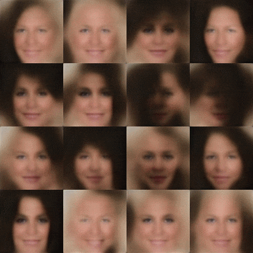
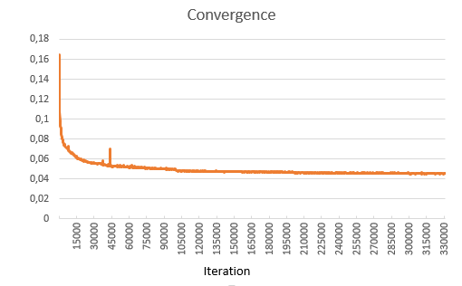
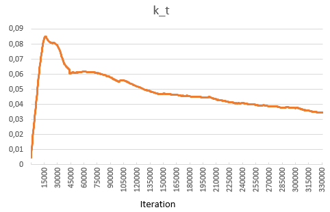

# Caffe_BEGAN: A Caffe/C++ implementation of [Boundary Equilibrium Generative Adversarial Networks](https://arxiv.org/abs/1703.10717) algorithm for face generation

Implementation of BEGAN algorithm for face generation. Here are some examples (128x128 images) with a model trained on 26 epochs of CelebA dataset (gamma = 0.5). The holes are due to the high gamma value. A smaller value of gamma (as 0.3 for example) would result in better images but with less diversity.

The evolution of the training from epoch 0 to epoch 25:

## Dependencies

This code relies on [Caffe main branch](https://github.com/BVLC/caffe) with only two slight modifications in `solver.hpp`: 

- ApplyUpdate function must be moved from protected to public in Solver class definition
- iter_ must be moved from protected to public in Solver class definition

OpenCV and boost are also used, but you should already have them installed if you have Caffe.

As Caffe doesn't have a L1-Loss layer, I have used existing layers to build the equivalent (the four last layers of `launch_files/discriminator.prototxt`).

I have only tested this code on Windows with Visual Studio 2015, but it should also be able to run on Linux and OS X provided that Caffe is correctly installed with the above modification.

## Building

The project uses CMake as a building tool.
Once you have correctly built and compiled the code, you should be abble to launch the program for both training and testing.

## Testing

To test a model, set the testing parameters and then launch `launch_files/test.bat`.
A file with the weights of a trained model is provided if you just want to see it generating faces: `launch_files/BEGAN_Generator_iter_325000.caffemodel`. It will display some images generated from random inputs.

## Training

First, you need to create a folder with all the training images. You can have as many images as you want (jpg, png or bmp): they are loaded and unloaded on a separate thread during training so you do not need tens of Gb of RAM. If you want to use [CelebA dataset](http://mmlab.ie.cuhk.edu.hk/projects/CelebA.html), please use the aligned and cropped images because the program will always use only the center 128x128 pixels (or the whole image if it is smaller) and resize it to the desired size.

Then you can train a model: set the training parameters as you want and then launch `launch_files/train.bat`. Images are saved (5 per epoch) to show the evolution of the learning process. Loss values are also saved in a csv file to monitor the training. Prototxt files (generator.prototxt and discriminator.prototxt) are regenerated everytime the program is launched (because they have to change with batch size, image size, input dimension ...).

During training, several files are created:
- caffemodel and solverstate to save networks states
- k_t files to save k_t values along with caffe snapshots
- log file to save losses
- preview_values.csv to keep the random inputs used to display images during training

All those files are used if you want to stop the training and continue it later (it took me almost 3 days to train the above 128x128 model on a Nvidia GTX 1070).

If everything is correct, your learning curves should look like those ones:

### Resuming Training

To resume training, you just need to add the snapshosts parameters to the train.bat file and launch it again. If the program finds the log file and the preview_values file, they should be loaded as well. New ones are created otherwise (so you won't have consistent faces between the images before and after you stop).

## License

MIT